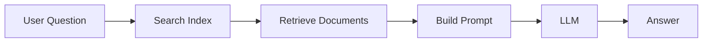
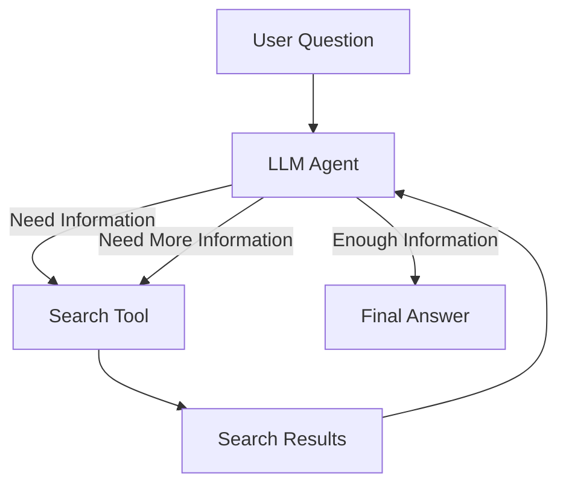

# From Traditional RAG to Agentic RAG

In the first part of the lesson, we built a traditional Retrieval-Augmented Generation (RAG) pipeline. The process is fixed: a user question is sent to a search engine, the most relevant documents are retrieved, a prompt is built using these results, and the prompt is sent to the LLM for answer generation. This approach works well when the user's query closely matches the indexed content, but it has limitations. If the query contains typos, uses unusual wording, or requires information from multiple searches, the retrieval step may fail and the LLM has no opportunity to recover because the search is executed only once.

## Traditional RAG Flow

### Characteristics

* Fixed sequence of steps
* One search per question
* Simple and cost-effective
* Easy to implement and maintain
* Can fail when the query contains typos or requires multiple retrieval attempts

---

In the second part of the lesson, we introduced the concept of agents. Instead of the developer controlling the sequence of actions, the LLM is given access to tools, such as a search function, and decides when and how to use them. Through function calling and the agentic loop, the model can perform multiple searches, refine its queries, analyze intermediate results, and continue searching until it has enough information to answer confidently. Frameworks such as ToyAIKit automate this loop by managing tool execution, conversation history, and repeated model calls. This transforms a rigid RAG workflow into a more flexible and intelligent system capable of handling ambiguous questions, correcting mistakes, and exploring information iteratively before producing a final response.

## Agentic RAG Flow

### Characteristics

* LLM controls the workflow
* Multiple searches are possible
* Can reformulate queries and recover from errors
* More flexible and adaptive
* Higher cost due to multiple LLM calls
* Increased latency and operational complexity

---

## Traditional RAG vs Agentic RAG

| Aspect                | Traditional RAG | Agentic RAG  |
| --------------------- | --------------- | ------------ |
| Searches              | One             | Multiple     |
| Flow Control          | Developer       | LLM          |
| Complexity            | Low             | Medium/High  |
| Cost                  | Lower           | Higher       |
| Latency               | Lower           | Higher       |
| Adaptability          | Limited         | High         |
| Error Recovery        | Poor            | Better       |
| Implementation Effort | Simple          | More Complex |

---

## Key Takeaway

Agentic systems are powerful, but they are not always the right solution. Every tool call requires additional LLM requests, which increases latency, token usage, and cost. Agents also introduce more complexity because they require tool integration, conversation management, monitoring, and safeguards to prevent excessive or incorrect actions.

For many business use cases, a simple RAG pipeline or even a single LLM call is sufficient and easier to maintain. Before introducing agents, it is worth asking whether the problem truly requires dynamic decision-making and multiple tool interactions. A good engineering practice is to start with the simplest solution that works and introduce agentic capabilities only when there is a clear need for iterative reasoning, multi-step retrieval, or autonomous decision-making.
