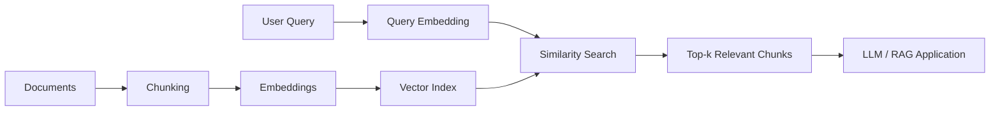

# Module 2 – Vector Search

> *Understanding how modern AI systems search by meaning rather than exact words.*

This module is part of my **LLM Zoomcamp 2026 – Learning in Public** journey.

The goal is not only to complete the homework but also to understand the concepts behind modern Retrieval-Augmented Generation (RAG) systems and document my learning through notes, diagrams, and practical implementation.

---

# Why Vector Search?

Traditional search engines rely on **exact keyword matching**. While effective for finding specific terms, they struggle with synonyms, paraphrases, and semantic meaning.

Vector Search addresses this limitation by representing text as **embeddings**—numerical vectors that capture semantic relationships between documents and queries.

This approach enables AI systems to retrieve information based on **meaning**, making it one of the core components of modern RAG applications.

---

# Architecture Overview

---

# Topics Covered

* Embeddings
* Cosine Similarity
* Chunking
* Manual Vector Search
* Vector Indexing
* Semantic Search
* Keyword Search
* Hybrid Search
* Reciprocal Rank Fusion (RRF)

---

# Lessons Learned

During this module I learned that:

* Embeddings transform text into numerical vectors that preserve semantic meaning.
* Cosine similarity provides a simple way to measure how similar two pieces of text are.
* Chunking improves retrieval by indexing smaller and more focused sections of a document.
* Vector Search retrieves information based on meaning rather than exact wording.
* Keyword Search remains valuable for exact terms such as identifiers, names, or codes.
* Hybrid Search combines both approaches to improve retrieval quality.

---

# Frequently Asked Questions

### Why do we chunk documents?

Large documents often contain multiple topics. Chunking creates smaller, more focused pieces that improve retrieval accuracy.

### Why don't we embed filenames?

The semantic information is contained in the document content. Filenames are better suited for keyword filtering.

### Why do we still need keyword search?

Because semantic search may miss exact identifiers, acronyms, or product names.

### Why use Hybrid Search?

It combines the strengths of semantic retrieval and exact keyword matching.

---

# Real-world Applications

These concepts are commonly used in:

* Enterprise Knowledge Assistants
* Customer Support Chatbots
* Banking Knowledge Bases
* Internal Document Search
* Policy and Regulatory Search
* Semantic Enterprise Search

---

# Reflection

Before this module, I viewed vector databases as a black box used by RAG frameworks.

Implementing vector search manually helped me understand what actually happens behind the scenes—from embeddings and cosine similarity to indexing and hybrid retrieval.

This deeper understanding will help me design more robust and explainable AI systems.

---

# Learning in Public

Throughout the LLM Zoomcamp, I share my learning journey by publishing visual summaries and key takeaways.

### Social Posts

🐦 **X**

*(Add your X post URL here)*

💼 **LinkedIn**

*(Add your LinkedIn post URL here)*

---

# References

* LLM Zoomcamp 2026
  https://github.com/DataTalksClub/llm-zoomcamp

* DataTalksClub
  https://github.com/DataTalksClub

* Alexey Grigorev
  https://github.com/alexeygrigorev

---

> *Learning is most valuable when knowledge is shared.*
